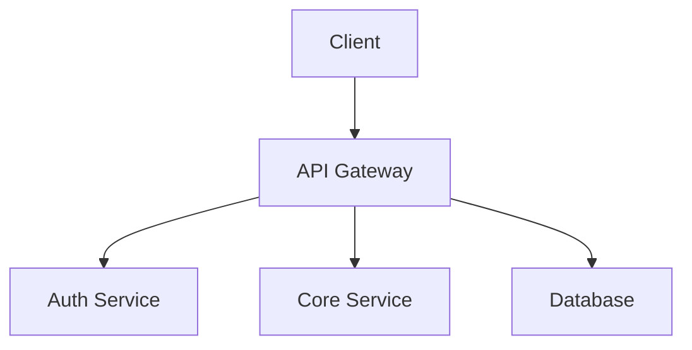

## System Architecture

## Key Components

| Component | Description |
|-----------|-------------|
| Client | Frontend application |
| API Gateway | Routes and rate limiting |
| Auth Service | Authentication & authorization |
| Core Service | Business logic |
| Database | Data persistence |

## Design Principles

- **Modularity**: Components are loosely coupled
- **Scalability**: Horizontal scaling support
- **Security**: Defense in depth
